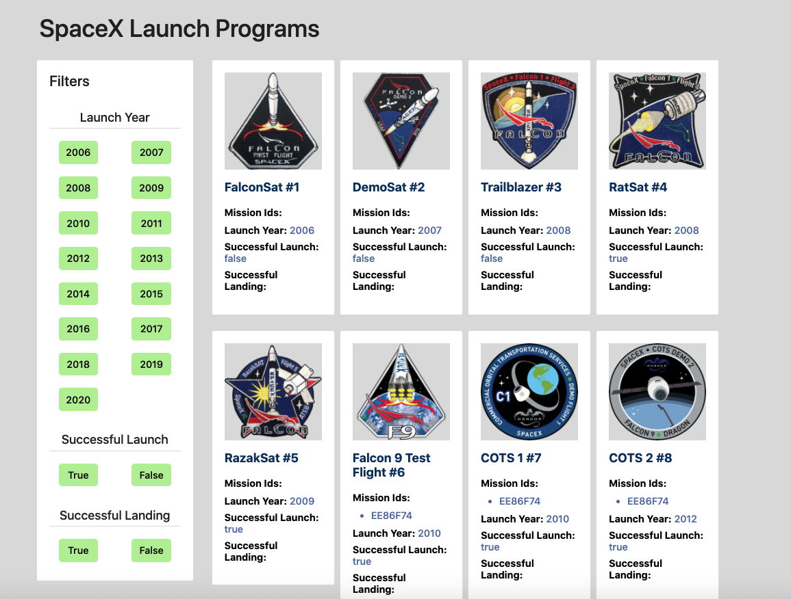
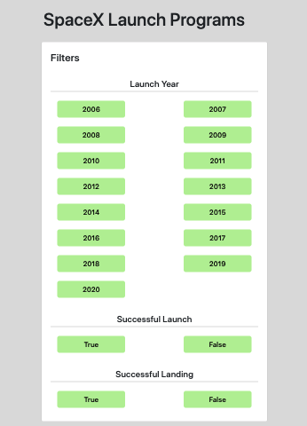
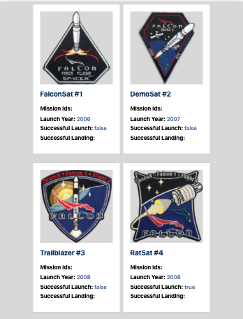
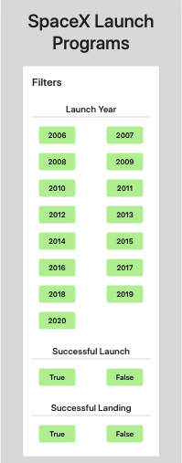
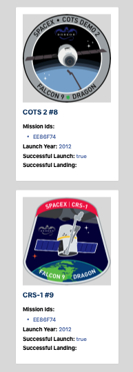
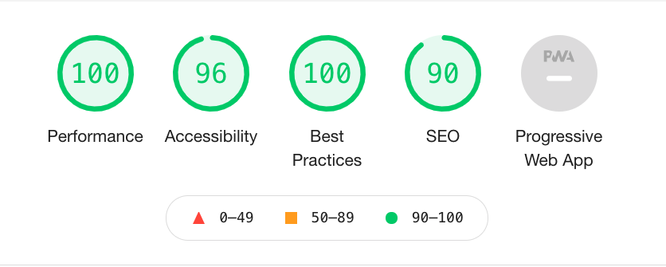

# SpaceXLaunchApp

This application helps users to browse all launches SpaceX programs. This is server-side rendering application. 
The initial launch programs landing page is server side rendered. This application is deployed on netlify.

## Live Application Link

[SpaceX Launch App](https://amazing-mahavira-4eb744.netlify.app/)

## Application screenshots

1. Desktop View:

2. Tablet View:

3. Mobile View:

## Lighthouse Report:

## Technology Stack

1. Angular v11.1.2
2. Angular universal for server-side rendering.
3. Bootstrap v4.6.0 for styling and responsiveness.
4. RxJS v6.6.0 for using rxjs operators.
5. netlify to deploy angular application.

## Code scaffolding
Steps:

1. To create new angular application run `ng new angular-app`.
2. To add angular universal package in project run `ng add @nguniversal/express-engine`.
3. To add new component run `ng g c component-name`.
4. To add new service run `ng g s service-name`.
5. To add bootstrap package run `npm install bootstrap --save`.

## Build

Run `ng build` to build the project. The build artifacts will be stored in the `dist/` directory. Use the `--prod` flag for a production build.
To publish build run `npm run prerender` that will create artifacts in dist folder under dist/spaceX-Launch-App/browser.

## Development server

Run `npm run dev:ssr` for a dev server. Navigate to http://localhost:4200/

## Running unit tests

Run `ng test` to execute the unit tests via [Karma](https://karma-runner.github.io).

## Lint Report
Run `ng lint` to generate linting report.

